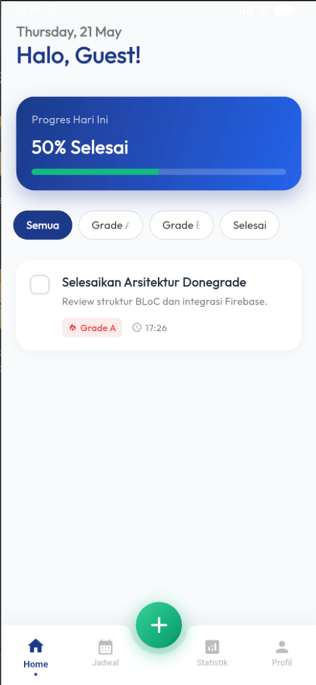

<div align="center">
  

  # 🎓 DoneGrade
  
  **A Smart Task & Productivity Management App built with Flutter**
  
  [](https://flutter.dev/)
  [](https://firebase.google.com/)
  [](https://bloclibrary.dev/)
  [](https://opensource.org/licenses/MIT)

  <p align="center">
    <a href="#features">✨ Features</a> •
    <a href="#tech-stack">🛠️ Tech Stack</a> •
    <a href="#getting-started">🚀 Getting Started</a> •
    <a href="#screenshots">📸 Screenshots</a>
  </p>
</div>

---

## 📖 About DoneGrade

**DoneGrade** is a modern and beautifully designed productivity app to help you track your tasks, schedules, and monitor your personal growth through statistics. Whether you are a student tracking your grades or a professional managing daily workflows, DoneGrade offers a seamless experience with offline support and real-time syncing.

## ✨ Features

- **🔐 Authentication**: Secure login and registration using Firebase Auth.
- **📅 Calendar Integration**: Manage tasks and view upcoming schedules interactively.
- **📊 Interactive Statistics**: Visual charts and graphs representing your productivity and grades (powered by `fl_chart`).
- **🌓 Dark & Light Mode**: Aesthetically pleasing dynamic UI adopting Material 3 design and Google Fonts (Outfit).
- **🔔 Local Notifications**: Never miss a deadline with scheduled reminders.
- **📂 Offline & Online Sync**: Utilizes SQLite (`sqflite`) for local caching and Firestore for cloud sync.

## 🛠️ Tech Stack

- **Framework:** [Flutter](https://flutter.dev/)
- **Language:** Dart
- **State Management:** [BLoC](https://pub.dev/packages/flutter_bloc) & [Equatable](https://pub.dev/packages/equatable)
- **Backend & Database:** Firebase (Auth & Cloud Firestore), SQLite (`sqflite`)
- **UI/UX:** Material 3, Google Fonts, Cupertino Icons
- **Charts:** `fl_chart`

## 📸 Screenshots

<div align="center">
  
</div>

## 🚀 Getting Started

Follow these instructions to get a copy of the project up and running on your local machine for development and testing purposes.

### Prerequisites

- Flutter SDK (v3.9.2 or higher)
- Dart SDK
- Android Studio / VS Code
- A Firebase Project (for Auth and Firestore)

### Installation

1. **Clone the repository**
   ```bash
   git clone https://github.com/Ragit09/Donegrade.git
   cd Donegrade
   ```

2. **Install dependencies**
   ```bash
   flutter pub get
   ```

3. **Configure Firebase**
   - Create a project on the [Firebase Console](https://console.firebase.google.com/).
   - Add your Android & iOS apps.
   - Download the `google-services.json` (Android) and `GoogleService-Info.plist` (iOS).
   - Place them in their respective directories (`android/app/` and `ios/Runner/`).

4. **Run the App**
   ```bash
   flutter run
   ```

## 🤝 Contributing

Contributions, issues, and feature requests are welcome! Feel free to check the [issues page](https://github.com/Ragit09/Donegrade/issues).

## 📄 License

This project is licensed under the MIT License - see the LICENSE file for details.

---

<div align="center">
  <b>Built with ❤️ by <a href="https://github.com/Ragit09">DhezetStudio</a></b>
</div>
